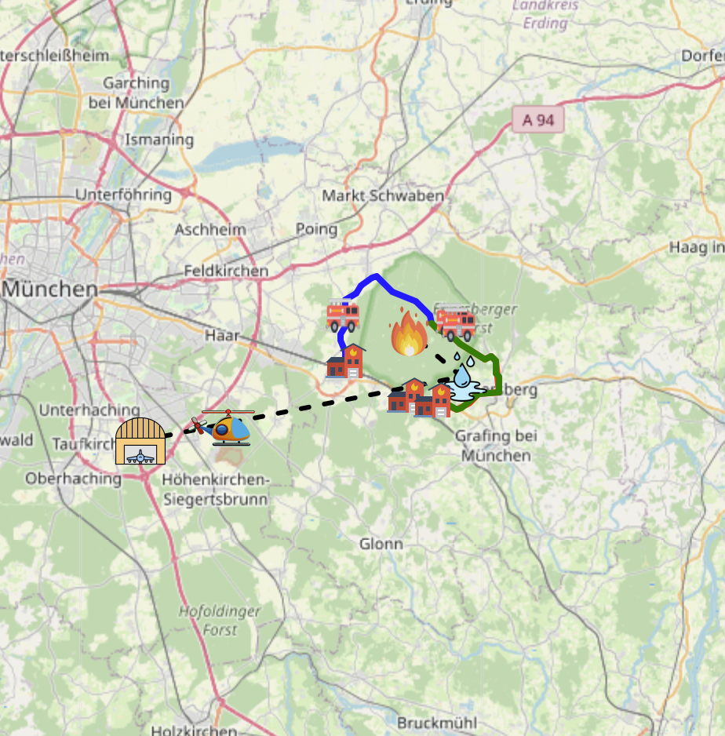
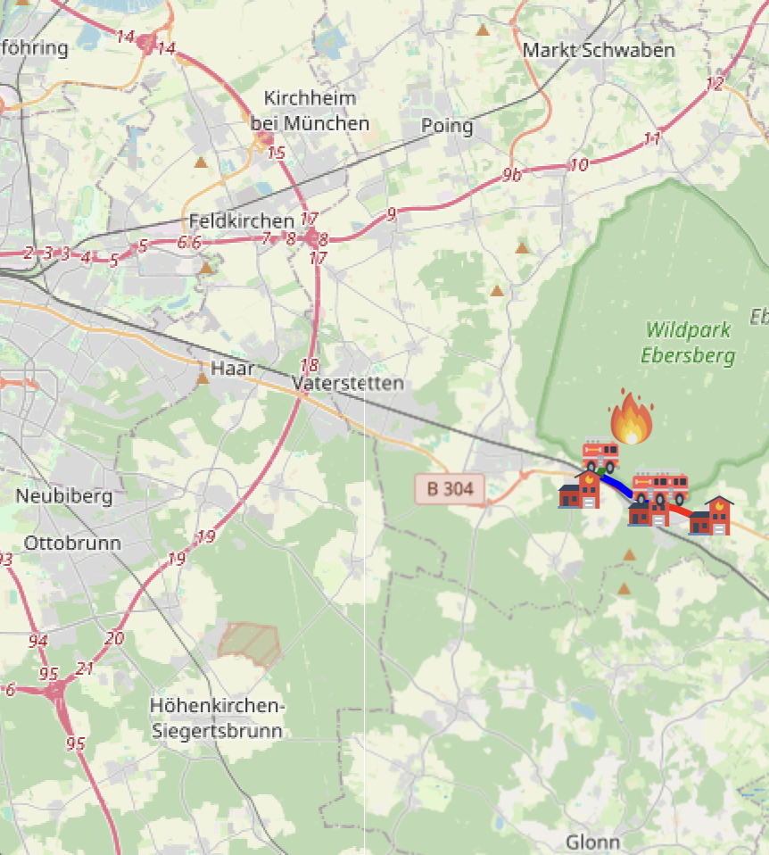
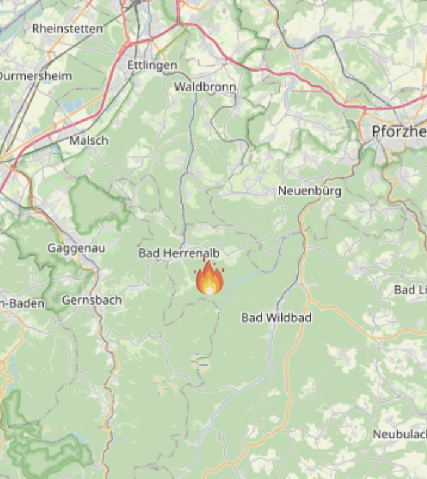
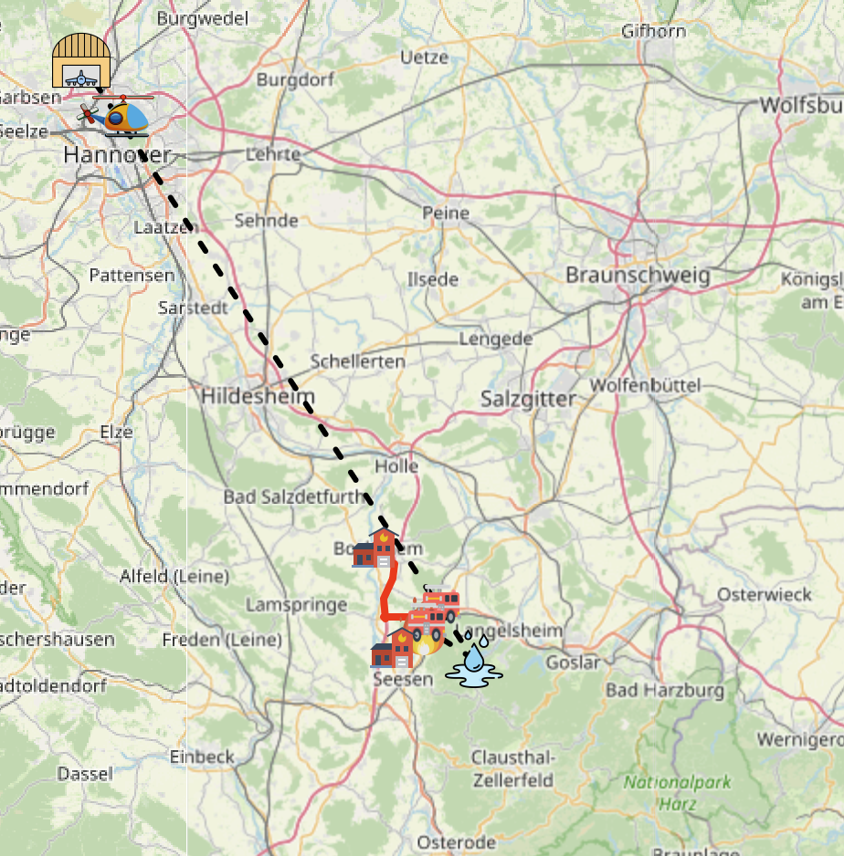
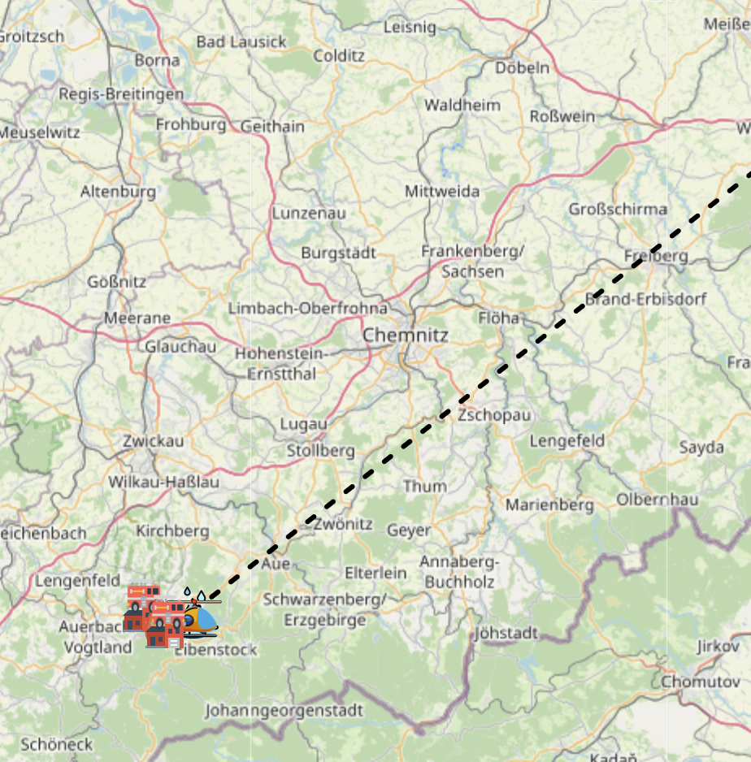

# NOTE
Due to large file sizes this project is hosted on a private git server. If interested in the source code feel free to contact me.

# FireGPT

An interactive fire-response assistant combining environmental diagnostics, map visualization, routing, and an LLM-powered chat assistant.

* **UI:** Dash + Leaflet (interactive map, animated routes, chat panel)
* **Routing:** OSRM (driving time to incident, off-road last meters)
* **AI:** Lightweight local LLM with RAG pipeline (document retrieval + context compression)
* **Scope:** Germany-only (the app warns if you click outside Germany)

---

## Table of Contents

* [Quick Start (Docker)](#quick-start-docker)
* [Building From Source (faster)](#building-from-source-faster)
* [Performance & Architecture Notes](#performance--architecture-notes)
* [How to Use the UI](#how-to-use-the-ui)
* [RAG: Things to Consider](#rag-things-to-consider)
* [UI: Things to Consider](#ui-things-to-consider)
* [System Workflow](#system-workflow)
* [Example Scenarios (Screenshots)](#example-scenarios-screenshots)
* [Where to Put the Screenshots](#where-to-put-the-screenshots)
* [Configuration](#configuration)
* [Troubleshooting](#troubleshooting)
* [Repository Structure (excerpt)](#repository-structure-excerpt)
* [License](#license)

---

## Quick Start (Docker)

> **Prerequisites:**
>
> * Docker & Docker Compose
> * (Optional) Credentials for `gitlab.lrz.de:5005`

1. **Login to the registry (if required):**

```bash
docker login gitlab.lrz.de:5005
```

2. **Pull the prebuilt images:**

```bash
docker compose pull
```

3. **Start the stack (OSRM + app):**

```bash
docker compose up -d
```

4. **Open the UI:**

```
http://localhost:5050/
```

(Depending on your setup, `http://127.0.0.1:5050/`, `http://127.0.0.1:5050/` or `http://10.180.169.138:5050/` works.)

> **Heads-up:** the first request in Docker can be slow; see [Performance & Architecture Notes](#performance--architecture-notes).

---

## Building From Source (faster)

> Recommended if you’ll run many tests or develop features.

**Prerequisites**

* Python **3.11.13** or newer
* Docker (for the OSRM sidecar)

**Steps**

1. (Optional) Create a venv

```bash
python -m venv .venv
source .venv/bin/activate   # Windows: .venv\Scripts\activate
```

2. Install deps

```bash
pip install -r requirements.txt
```

3. Start OSRM via Docker (routing backend):

```bash
docker compose up -d osrm
```

4. Run the app locally (much faster than Dockerized app):

```bash
python app.py
```

5. Open:

```
http://localhost:5050/
```
(Depending on your setup, `http://127.0.0.1:5050/`, `http://127.0.0.1:5050/` or `http://10.180.169.138:5050/` works.)

---

## Performance & Architecture Notes

* **Docker vs. local:** On our test machines the app **runs much slower in Docker** than directly on the host: \~**1–2 minutes locally** vs. **\~10 minutes in Docker** for comparable first responses.
  We’re still shipping a Docker image because it’s a hard requirement for the submission.
* **Why slower?**

  * Containerized CPU scheduling & filesystem overhead
  * Emulation layers on Apple Silicon when images are `amd64`
  * Small, local LLM (Gemma 2B class) isn’t blazing fast on CPU and has **limited context**
* **Tip:** For demos and iterative development, use the **source build** (above). Use Docker for reproducible submissions.

---

## How to Use the UI

1. **Open the map** and **click a location in Germany** to place the fire.

   * If you click outside Germany, a **banner** informs you that the region isn’t supported.

2. **Adjust fire radius** with the slider overlay.

3. Choose whether to **add additional info** (chat appears).

   * If you select **No**, the system *auto-generates* a first response after routing + diagnostics.
   * If you select **Yes**, write details first, then press **Send** to get the first response.

4. The app:

   * Draws **routes** from the fastest fire stations
   * Optionally plans a **helicopter** hop (base → water → fire)
   * Shows a **structured Markdown** recommendation in the chat

5. **Ask follow-up questions** in the chat.

   * The conversation state is kept short to avoid overloading the small LLM.

6. Use **Reset** to start a new incident.

---

## RAG: Things to Consider

* **Small fire radius** can lead to **worse retrieval** (not enough spatial signal).
* **Limited context size** → degraded performance if too many documents are pulled.
* Our **Gemma-2B-class model** struggles with **math/units** at times (e.g., interpreting fire sizes). We mitigated this but a stronger LLM would help (likely not runnable locally).
* **Non-deterministic outputs** & **prompt sensitivity:**

  * Sometimes you might get very short or even missing answers.
  * **Just ask again with the same question**—a second attempt typically yields a full response.
* The **test cases** below are spread across Germany to show location-aware retrieval.

---

## UI: Things to Consider

* **OSRM doesn’t include every rural path (Feldweg)** → we route to the **nearest road**; the final **off-road segment** is estimated separately (walking-speed approximation).
* **Fire stations** and **helicopter bases** are grounded in **real locations** in Germany.

---

## System Workflow

**Step 1 – Enhanced query construction**
We merge the raw user question with environmental diagnostics (land cover, temperature, humidity, station types, legal notes) to form an **enhanced master query** for semantic search.

**Step 2 – Document retrieval**
Up to **8** relevant chunks are retrieved via **four** structured sub-queries (legal duties, tactics, resources, hazards), routed into thematic & geographic buckets.

**Step 3 – Context compression**
A small LLM extracts only clearly relevant sentences (≈ **70% token reduction**).

**Step 4 – Generation**
The LLM receives a **structured prompt** and returns Markdown with predefined sections (**Deployed Stations, Helicopter, Additional Considerations**). Follow-ups include short conversation history.

**Step 5 – History management**
We only retain **recent** chat info to keep the model focused and fast.

**Step 6 – UI output visualization**
Deployed resources are shown on the **map** (first query), plus the **Markdown** answer in the chat.

**Step 7 – Follow-up handling**
Repeat steps 4–6 until you **Reset** to start a new incident.

---

## Example Scenarios (Screenshots)


### L1 — Bavaria: Wildpark Ebesberg

* **Fire radius:** 70 m
* **Additional info:** —
* **Follow-up question:** *What alternatives do we have if the helicopter is grounded due to weather conditions?*
  

---

### L2 — Bavaria: Wildpark Ebesberg (no helicopter available)

* **Fire radius:** 70 m
* **Additional info:** No helicopter can be deployed due to technical issues with the communication system.
* **Follow-up question:** *When should we consider evacuating nearby residential areas?*
  

---

### L3 — Baden-Württemberg: near Bad Wildbad

* **Fire radius:** 40 m
* **Additional info:** —
* **Follow-up question:** *How do we protect personnel if wind conditions suddenly change?*
  

---

### L4 — Saxony-Anhalt: small forest north of Seesen (south of Hannover), north of the Harz

* **Fire radius:** 90 m
* **Additional info:** —
* **Follow-up question:** *What should be our priority if multiple fires break out simultaneously in the region?*
  

---

### L5 — Saxony: southeast of Chemnitz, near Eibenstock

* **Fire radius:** 20 m
* **Additional info:** —
* **Follow-up question:** *How do we coordinate with forestry services if the fire reaches protected areas?*
  

---

## Configuration

The app reads a few environment variables (via `python-dotenv`):

* `OSRM_URL` – Base URL of the routing backend.

  * **Docker Compose (default in app container):** `http://osrm:5000`
  * **Local dev (if you map host port 5001 → 5000 in the OSRM container):** `http://localhost:5001`
* `FIREGPT_MODEL_PATH` – Optional path to a local `.gguf` model (if you override the default).
* `GGML_METAL_VERBOSE=0` – (Optional) reduces Metal backend logs on macOS.

Example `.env`:

```env
OSRM_URL=http://localhost:5001
FIREGPT_MODEL_PATH=./local_models/gemma2.gguf
GGML_METAL_VERBOSE=0
```

**Ports**

* App UI: `5050` (host) → `5050` (container)
* OSRM: commonly `5001` (host) → `5000` (container)

---

## Troubleshooting

**It says “region not supported.”**
Only Germany is supported. Zoom to Germany and click again.

**The first answer takes forever.**

* Docker cold start + local LLM = slow. Try **building from source** for much faster runs.
* On Apple Silicon, running `amd64` images under emulation is slower.

**No OSRM routes / errors about routing.**

* Ensure the OSRM container is running: `docker compose ps`
* Confirm `OSRM_URL` points to your OSRM service (`http://osrm:5000` inside Docker; `http://localhost:5001` from host if you mapped ports).

**The bot replied with a single short line or nothing.**

* The model is **non-deterministic** and **prompt-sensitive**.
* **Ask the same question again**—a second try typically returns a complete answer.

**Helicopter suggestions look odd.**

* The model may be off with **math/units**. The path is still drawn (base → water → fire), but validate feasibility with domain knowledge.


---

**Happy testing, and stay safe.** 🚒🔥
